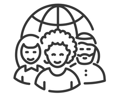

# Unidade 1 - 1. Definição de Cultura

- Origem: [Canvas](https://pucminas.instructure.com/courses/230797/pages/unidade-1-1-definicao-de-cultura)

---

#### **Definição de Cultura**

Uma das definições mais interessantes e completas é feita por Tylor:

“*Todo aquele complexo que inclui o conhecimento, as crenças, a arte, a moral, a lei, os costumes e todos os outros hábitos e capacidades adquiridos pelo homem como membro de uma sociedade*”

Com base na definição anterior, alguns pontos chave podem ser levantados e que farão sentido ao relacionarmos com o as áreas de DevOps, DataOps e MLOps :

- **Complexo**: envolve relações complexas entre as pessoas
- **Conhecimento**: parte-se do pressuposto que existe alguma forma de conhecimento tácito (aquele que é adquirido à partir de experiências pessoais)
- **Costumes**: refere-se a um hábito ou uma prática regular/recorrente
- **Sociedade**: grupo de pessoas que compartilham de valores

Caso fossemos criar uma definição mais informal do conceito de cultura, poderíamos chegar ao seguinte: Cultura é o conjunto de hábitos, práticas de forma recorrente entre pessoas as quais  buscam compartilhar conhecimento entre si. 

Mas você deve estar se perguntando, como esses conceitos podem se relacionar com o conteúdo que será visto nesta disciplina? Já adiantando, está completamente relacionado, principalmente no que tange ao conjunto de hábitos e o compartilhamento de conhecimento.

Quando entrarmos mais em detalhes sobre cada uma das áreas de DataOps e MLOps, veremos que existe uma cultura que deve ser criada nas organizações com o objetivo de ganhar eficiência na operação e sustentação de dados e modelos de aprendizado de máquina.

A seguir, assista ao vídeo sobre o conceito de cultura.
