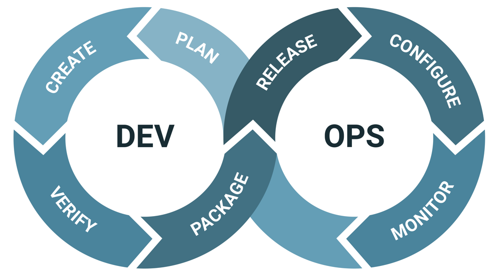

# Unidade 1 - 2. Fundamentos de DevOps

- Origem: [Canvas](https://pucminas.instructure.com/courses/230797/pages/unidade-1-2-fundamentos-de-devops)

---

#### **Fundamentos de DevOps**

Antes de direcionarmos nosso estudo aos campos de DataOps e MLOps e entendermos seu significado, é necessário conhecer sua origem: DevOpsAnteriormente, as funções de desenvolvimento de *software* e operações de TI (engenharia e segurança) atuavam de forma isolada, o que em alguns casos acabavam resultando em equipes com objetivos distintos.  Para  que as equipes pudessem gerar produtos com melhor qualidade e confiança, foi criada a área denominada DevOps a qual é o composto entre duas siglas Dev (*development* - desenvolvimento) + Ops (*operations* - operações). Assista a seguir um vídeo sobre os fundamentos de DevOps.

Quando uma empresa adota uma cultura de DevOps, juntamente com as práticas e as respectivas ferramentas, as equipes melhoram sua capacidade de resposta às necessidades dos clientes e, consequentemente, aumentam a confiança nos softwares desenvolvidos e cumprem os objetivos de forma mais eficiente.

**Ciclo de DevOps**

O ciclo de DevOps é um ciclo infinito que mostra o relacionamento das fases do ciclo de vida de DevOps. Este ciclo apresenta a constante colaboração da equipe em conjunto com a constante melhoria iterativa durante o ciclo de vida de um produto.

 

Para entendermos melhor o ciclo, vamos dividi-lo nas duas fases: desenvolvimento e operação. A fase de desenvolvimento representa toda a implementação de uma entrega feita pela equipe. Se divide nas seguintes etapas:

- **Planejamento**: definição de qual entrega será feita;
- **Criação/Desenvolvimento**: implementação da entrega;
- **Verificação/Teste**: testes de qualidade, integração, dentre outros;
- **Empacotamento**: criação do artefato a ser entregue;

A operação consiste na fase de “fazer funcionar” a entrega feita pela equipe. Consiste em algumas etapas:

- ***Release*****/Entrega**: realização da entrega do artefato;
- **Configuração**: configuração do ambiente o qual vai receber o artefato desenvolvido ;
- **Monitoramento/*****Feedback***: após a entrega feita pela equipe, entra a etapa de monitoramento da solução para coleta de *feedbacks* e correção preventiva de erros;
