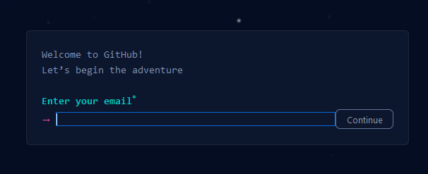
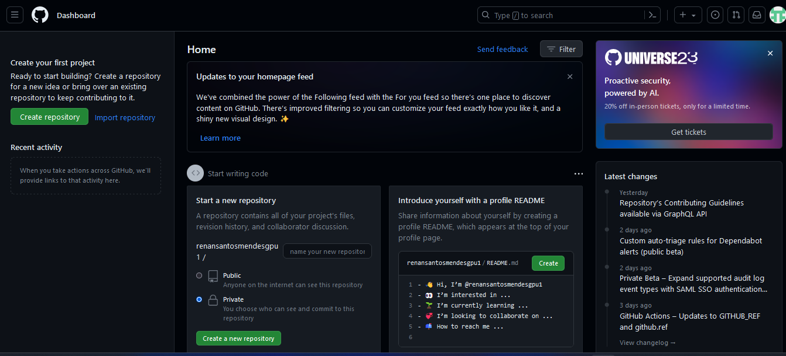
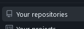
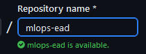
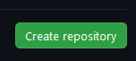

# Unidade 1 - Desafio e Resolução

- Origem: [Canvas](https://pucminas.instructure.com/courses/230797/pages/unidade-1-desafio-e-resolucao)

---

#### **Desafio 1 - Uso do GitHub**

**Enunciado**

Crie uma conta no GitHub e em seguida crie um repositório  

**Resolução**

Entre no site do GitHub acessando o [link](https://github.com/)

Clique no botão Sign Up 

Digite um email para associar a sua conta:

Em seguida adicione uma senha e um usuário para sua conta no GitHub.  

O GitHub irá utilizar algum mecanismo para poder detectar que você é um usuário real, portanto preste bastante atenção.

Como último passo na criação da conta, será enviado um email com um código que deve ser colado no site para finalizar as validações.

Se tudo estiver ok com a criação da conta, você será direcionado para a seguinte tela:

**Para criar um repositório**

Procure a opção 

Em seguida clique em 

Adicione um nome ao repositório 

Ao final, clique em 

Pronto, você acabou de criar uma conta no GitHub, já tem um repositório para ser utilizado e enviar seus códigos
