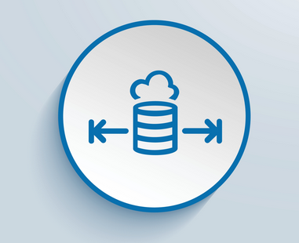
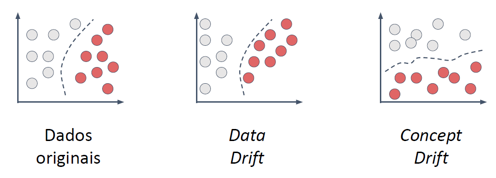

# Unidade 2 - 1. DataOps: Data Operations

- Origem: [Canvas](https://pucminas.instructure.com/courses/230797/pages/unidade-2-1-dataops-data-operations)

---

#### **DataOps - Data Operations**

É o termo que remete às operações com dados possuindo origem baseada em DevOps. O conceito tinha como proposta inicial ser um sistema de melhores práticas com dados, mas gradualmente amadureceu para uma abordagem totalmente funcional para lidar com a sua análise. Para sua implantação e execução com sucesso, existe uma sequência de princípio que direciona todas as práticas.

 

 **Princípios**

- **Satisfação contínua do cliente**: devem ser feitas entregas de valor, ou seja, que agreguem ao cliente e de forma contínua. Podem ser dados brutos para uma futura análise, dados agregados, relatórios ou até mesmo *pipelines* de dados;
- **Foco em análises relevantes**: quando alguma análise ou insight for solicitado, ter foco naqueles que sejam úteis para o cliente;
- **Abraçar a mudança**: é sempre importante considerar a necessidade dos clientes;
- **Ser coletivo com auto-organização**: equipes de dados com diversos papéis trazem diversidade de ideias, ferramentas, arquiteturas e novas possibilidades. Acredita-se que dando liberdade para as equipes tomarem as melhores decisões elas poderão extrair os melhores qualidades/características de cada participante;
- **Interações diárias:** interações diárias facilitam a comunicação e resolução de incidentes;
- **Redução do heroísmo**: com as possibilidades de resolução dos problemas e a diversidade de problemas, as equipes devem focar em resolver um problema por vez, evitando o heroísmo de tentar resolver todos de uma vez e acabar não conseguindo sair do lugar;
- **Ter reprodutibilidade**: é imprescindível que todos os processos sejam reprodutíveis para que em casos de falhas, o artefato de dado possa ser gerado novamente;
- **Qualidade**: a qualidade das entregas deve ser um dos grandes focos, evitando qualquer tipo de retrabalho, principalmente pelo custo envolvido. Exemplo: garantindo a qualidade de um pipeline de dados, evita o reprocessamento, principalmente quando o dado em questão for de um volume elevado;
- **Aplicar monitoramento**: monitorando os processos de dados é possível corrigir alguma falha antes que o cliente perceba, garantindo a qualidade do dado entregue;
- **Melhorar o *cycle* time:** ao se utilizar os princípios anteriores, o tempo de entrega acaba reduzindo como consequência da qualidade das entregas e dos próprios processos.

Embora haja algumas semelhanças entre DataOps e MLOps, como o uso de metodologias ágeis e a entrega contínua, eles têm objetivos e fluxos de trabalho diferentes. O DataOps se concentra na gestão de dados em toda a organização, enquanto o MLOps se concentra na implantação e gerenciamento de modelos de aprendizado de máquina em produção. Assista a seguir um vídeo abordando os conceitos deste módulo.

#### **Por que devemos aplicar DataOps?**

Existem vários motivos para implantar a cultura DataOps em uma empresa, incluindo:

1. **Processos mais ágeis**: O DataOps permite que as equipes de dados trabalhem de forma mais ágil, com entregas incrementais e com valor, o que pode levar a uma maior eficiência e produtividade.
2. **Insights em tempo real**: Com o DataOps, as equipes de dados podem fornecer insights em tempo real para a empresa, permitindo que ela tome decisões mais informadas e rápidas.
3. **Democratização das informações**: O DataOps pode ajudar a democratizar as informações, permitindo que as equipes de negócios acessem e usem dados de forma mais eficaz.
4. **Foco estratégico**: O DataOps pode ajudar a empresa a se concentrar em seus objetivos estratégicos, permitindo que as equipes de dados trabalhem em projetos que agreguem valor real à empresa.
5. **Alinhamento entre negócios e TI:** O DataOps pode ajudar a alinhar as equipes de negócios e de TI, permitindo que elas trabalhem juntas de forma mais eficaz para atingir os objetivos da empresa.

#### **Aplicação: detecção de *data drift* em um *dataset***

*Data Drift* é um fenômeno em que os dados usados para treinar um modelo de ML mudam com o tempo. Isso pode levar a uma diminuição nas métricas do modelo, uma vez que o modelo pode não ser mais capaz de generalizar bem para novos dados. Em outras palavras, o *Data Drift* ocorre quando os dados de entrada do modelo mudam ao longo do tempo, o que pode afetar a precisão e a eficácia do modelo. Para lidar com o *Data Drif*t, é importante monitorar os dados usados para treinar os modelos, atualizar os dados regularmente e, se necessário, refazer os modelos completamente.

Existem dois tipos de *Drift*: *Data Drift* e *Concept Drift*.

- **Data Drift**: É um fenômeno em que os dados usados para treinar um modelo de Machine Learning mudam com o tempo. Isso pode levar a uma diminuição nas métricas do modelo, uma vez que o modelo pode não ser mais capaz de generalizar bem para novos dados.
- **Concept Drift**: É um fenômeno em que a relação entre os dados e a variável alvo muda com o tempo. Isso pode levar a uma diminuição na precisão do modelo, uma vez que o modelo pode não ser mais capaz de capturar a relação entre os dados e a variável alvo de forma eficaz. O Concept Drift pode ser resolvido refazendo o modelo.

A figura abaixo apresenta visualmente cada tipo de *drift* mencionado anteriormente.

Existem diferentes abordagens para lidar com cada tipo de *Drift*:

- ***Data Drift*:** é importante monitorar os dados usados para treinar os modelos, atualizar os dados regularmente e, se necessário, refazer os modelos completamente. A atualização dos dados pode ser feita por meio de técnicas como reamostragem, reequilíbrio de classes e reajuste de pesos.
- ***Concept Drift*:** é importante refazer o modelo completamente. Isso pode envolver a coleta de novos dados, a redefinição das variáveis de entrada e a redefinição da variável alvo. É importante lembrar que o *Concept Drift* pode ser um sinal de que o modelo precisa ser atualizado ou que a estratégia de negócios da empresa mudou. Portanto, é importante avaliar cuidadosamente a causa do *Concept Drift* antes de refazer o modelo
