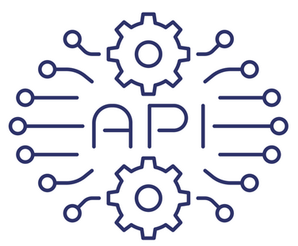

# Unidade 2 - 2. Fundamentos de MLOps

- Origem: [Canvas](https://pucminas.instructure.com/courses/230797/pages/unidade-2-2-fundamentos-de-mlops)

---

#### **MLOps: *Machine Learning Operations***

 

Agora quando mudamos o artefato entregue para um modelo de ML, o desenvolvimento e operação de modelos recebe o nome de MLOps que a junção de *Machine Learning + Operations.***

Para se desenvolver e produtizar um modelo de aprendizado máquina, três fases são necessárias para que o artefato seja elaborado e entregue:

- **Projetar o aplicativo baseado em ML**: a primeira fase é dedicada ao entendimento do negócio, entendimento dos dados e projeto do software baseado em aprendizado de máquina. Nesta etapa, é identificado o usuário em potencial, projeta-se a solução de aprendizado de máquina para resolver seu problema e avalia-se o desenvolvimento do projeto.
- **Experimentação e desenvolvimento de ML**: na segunda fase é verificada a aplicabilidade do aprendizado de máquina para o problema em questão, implementando a Prova de Conceito (POC). Nesta fase, executa-se etapas iterativamente diferentes, como identificar ou encontrar os melhores parâmetros do algoritmo adequado para o problema, engenharia de dados e/ou modelos. O objetivo principal nesta fase é fornecer um modelo de aprendizado de máquina de qualidade estável que será executado em produção.
- **Operações de ML**: o foco principal da terceira fase é entregar o modelo de aprendizado de máquina desenvolvido anteriormente em produção usando práticas de DevOps estabelecidas, como por exemplo: teste, controle de versão, entrega contínua e monitoramento;

Assista ao vídeo sobre a parte fundamental para compreender a operação de modelos de máquinas
