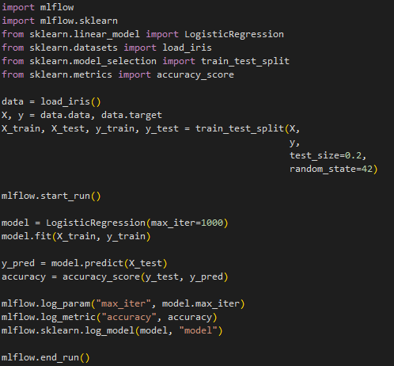

# Unidade 2 - Desafio e Resolução

- Origem: [Canvas](https://pucminas.instructure.com/courses/230797/pages/unidade-2-desafio-e-resolucao)

---

#### **Desafio 2 - Uso do MLflow**

**Enunciado**

No ciclo de vida de projetos de Machine Learning, é comum enfrentarmos desafios como:

- Perda de rastreabilidade de experimentos (quais parâmetros foram usados? qual foi o melhor resultado?);
- Falta de padronização na organização dos modelos e métricas;
- Dificuldade de comparar e reproduzir treinos anteriores;
- Pouco controle sobre versões de modelos ao longo do tempo.

À medida que os projetos crescem e se tornam mais colaborativos, essas limitações dificultam não apenas o desenvolvimento, mas também a entrega e manutenção de modelos em produção. É nesse contexto que entra uma das ferramentas mais utilizadas no ecossistema de MLOps: o **MLflow**.

O MLflow é uma plataforma open source que oferece suporte completo para gerenciar o ciclo de vida do ML, incluindo **rastreamento de experimentos, registro de modelos e reprodutibilidade**. Ele se integra facilmente com frameworks como Scikit-Learn, TensorFlow e PyTorch.

Neste desafio, você deverá:

- Instalar a biblioteca `mlflow` no seu ambiente python (pip install mlflow);
- Utilizar o MLflow para registrar parâmetros, métricas e artefatos durante o treino de um modelo. Escolha o *dataset*e treine qualquer modelo com base nesses dados
- Avaliar como o uso dessa ferramenta pode melhorar a rastreabilidade e a gestão dos experimentos no contexto de MLOps.

Tente fazer sozinho inicialmente e caso queira, acompanhe a resolução abaixo.

**Resolução**

Para monitorar o treinamento de um modelo de *Machine Learning* com o pacote MLflow, o primeiro passo é garantir que o MLflow esteja devidamente instalado. Isso pode ser feito através do comando `pip install mlflow`. Em seguida, é preciso iniciar um experimento. Um experimento no MLflow é uma execução de treinamento específica, com seus próprios conjuntos de parâmetros e métricas. Isso é feito com o comando `mlflow.start_run()`.

Posteriormente, o treinamento do modelo pode ser realizado como de costume. No exemplo fornecido, uma regressão logística é treinada utilizando o conjunto de dados Iris. Durante o treinamento, é possível registrar parâmetros e métricas relevantes no MLflow. Por exemplo, os parâmetros do modelo podem ser registrados com `mlflow.log_param()` e as métricas de desempenho, como a acurácia, podem ser registradas com `mlflow.log_metric()`.

Ao concluir o treinamento e registrar os parâmetros e métricas, é importante encerrar o experimento usando `mlflow.end_run()`. Isso assegura que o experimento seja finalizado adequadamente e os resultados sejam devidamente registrados.

Para visualizar os resultados do experimento, o servidor web do MLflow pode ser iniciado com o comando `mlflow ui`. Isso abrirá uma interface no navegador, permitindo a visualização dos experimentos, métricas, modelos e outras informações relevantes.

Adotando esses passos, os desenvolvedores podem efetivamente utilizar o MLflow para monitorar o treinamento de modelos de *Machine Learning*, mantendo um registro detalhado de parâmetros e métricas. Essa prática é essencial para o gerenciamento eficiente de experimentos no contexto de projetos de ML
