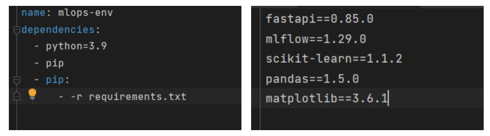

# Unidade 3 - 2. Ambientes de Desenvolvimento com Python e Anaconda

- Origem: [Canvas](https://pucminas.instructure.com/courses/230797/pages/unidade-3-2-ambientes-de-desenvolvimento-com-python-e-anaconda)

---

**Ambientes de Desenvolvimento com Python e Anaconda**

Um ambiente de desenvolvimento é um conjunto de ferramentas, bibliotecas e configurações que permitem que um desenvolvedor crie, teste e execute software. Esses ambientes podem ser configurados de diversas formas, dependendo das necessidades do projeto e das preferências do desenvolvedor. Alguns exemplos de ambientes de desenvolvimento são: IDEs (*Integrated Development Environments*), editores de texto, servidores web, bancos de dados, entre outros. O objetivo de um ambiente de desenvolvimento é fornecer ao desenvolvedor as ferramentas necessárias para que ele possa trabalhar de forma eficiente e produtiva.

Anaconda e o Python podem nos ajudar em programação científica e gerenciamento de pacotes. O Anaconda é uma distribuição de Python que facilita o gerenciamento de pacotes e a implantação em múltiplos sistemas operacionais. Ele inclui uma série de bibliotecas e ferramentas para análise de dados, aprendizado de máquina, visualização, entre outras áreas da programação científica. Já o Python é uma linguagem de programação de alto nível que é amplamente utilizada em diversas áreas, incluindo ciência de dados, inteligência artificial, desenvolvimento web, entre outras. Com o Python, é possível criar programas e scripts para automatizar tarefas, processar dados, criar visualizações, entre outras atividades. Em resumo, o Anaconda e o Python são ferramentas poderosas para quem trabalha com programação científica e análise de dados, permitindo que os desenvolvedores trabalhem de forma mais eficiente e produtiva. Assista a seguir o conteúdo sobre ambientes e Python.

#### **Ambientes de Virtuais**

Ambientes virtuais são ambientes isolados que permitem o uso de diferentes versões de bibliotecas em um mesmo sistema. Eles permitem que os desenvolvedores criem ambientes de desenvolvimento específicos para cada projeto, com suas próprias dependências e configurações. Isso é especialmente útil quando se trabalha em vários projetos ao mesmo tempo, ou quando se precisa testar diferentes versões de bibliotecas ou pacotes. Com os ambientes virtuais, é possível criar um ambiente de desenvolvimento limpo e isolado para cada projeto, sem interferências de outras bibliotecas ou pacotes instalados no sistema. Isso ajuda a evitar conflitos de dependências e a garantir que o código seja executado de forma consistente em diferentes sistemas. A figura a seguir mostra dois arquivos para criação de ambientes virtuais com o Anaconda. O arquivo à esquerda apresenta uma extensão .yml no qual é possível criar um ambiente totalmente automatizado, instalando inclusive a versão do Python. Na direita é apresentado um arquivo com a extensão .txt, geralmente denominado requirements.txt no qual apresenta apenas os pacotes e suas respectivas versões.

- **Figura à esquerda**: comandos para a criação e ativação de um ambiente:
  - *conda env create -f environment.yml* (cria o ambiente)
  - *conda activate mlops-env* (ativa o ambiente criado)
  - *conda deactivate* (desativa o ambiente)
- **Figura à direita**: comandos para a criação de um ambiente vazio:
  - *conda create --name myenv python=3.9* (cria o ambiente apenas com a versão 3.9 do Python)
  - *conda activate myenv* (ativa o ambiente)
  - *Ex.: pip install "tensorflow<2.11"* (instala um ou vários pacotes)
