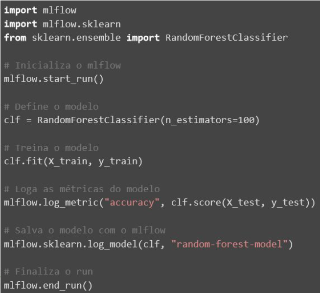

# Unidade 3 - 3.  Registro de Modelos e Ciclo de Vida

- Origem: [Canvas](https://pucminas.instructure.com/courses/230797/pages/unidade-3-3-registro-de-modelos-e-ciclo-de-vida)

---

#### **Registro de Modelos e Ciclo de Vida**

Um registro de modelos de ML, também conhecido como controle de versão de modelos ou *model registry*, é uma ferramenta que permite centralizar todas as informações sobre modelos de *Machine Learning*, incluindo detalhes sobre parâmetros, métricas de desempenho e versões anteriores do modelo. Ele também permite reverter alterações feitas em modelos e escolher qual modelo é o melhor para ser utilizado em produção. Alguma das ferramentas que podem ser utilizadas para se registrar os modelos são o *MLflow* e *Wandb.* A seguir, acompanhe a aula sobre o tema:

O código a seguir apresenta uma forma de ser feito o log de uma métrica e principalmente, fazer o registro do modelo.  

O código faz a seguinte sequência de passos

- **Importação de Bibliotecas:** No início, importamos as bibliotecas necessárias para o código. O MLflow é a biblioteca principal que usamos para registrar métricas e modelos treinados. Scikit-learn é uma biblioteca popular para aprendizado de máquina em Python.
- **Inicialização da Execução do MLflow:** Inicializamos a execução do MLflow com `mlflow.start_run()`, garante o experimento seja inicializado.
- **Treinamento do Modelo:** Aqui, criamos um modelo de classificação chamado "RandomForestClassifier" com 100 árvores de decisão. O modelo é treinado com os dados de treinamento.
- **Fazendo Previsões e Calculando a Métrica:** Usamos o modelo treinado para fazer previsões no conjunto de teste e calculamos a métrica de acurácia. A acurácia mede a proporção de previsões corretas em relação ao total de previsões.
- **Registro da Métrica no MLflow:** Utilizamos o MLflow para registrar a métrica de acurácia. Isso nos permite acompanhar o desempenho do modelo ao longo do tempo.
- **Salvando o Modelo Treinado:** O modelo treinado é salvo no MLflow com um nome específico, "random\_forest\_model". Isso permite que você reutilize o modelo posteriormente.
- **Encerramento da Execução do MLflow:** Finalizamos a execução do MLflow com `mlflow.end_run()`, garantindo que todas as métricas e registros do modelo sejam armazenados corretamente.

No geral, este código demonstra como treinar um modelo de classificação, avaliar seu desempenho, registrar métricas e salvar o modelo treinado usando o MLflow, uma ferramenta poderosa para gerenciamento de projetos de aprendizado de máquina.

#### **Ciclo de Vida e Ambientes**

Os ambientes de teste, homologação e produção são ambientes utilizados no processo de implementação de modelos de *Machine Learning* para gerenciar o ciclo de vida de um modelo. O **ambiente de teste** é onde são realizados os testes iniciais, em um ambiente semelhante ao de produção, para identificar problemas iniciais. O **ambiente de homologação** é onde são realizados testes mais amplos, utilizando dados reais e, em alguns casos, clientes podem validar o modelo. Já o **ambiente de produção** é onde o modelo é liberado para utilização, utilizando dados reais e em várias situações.
