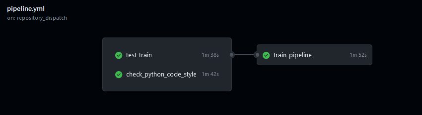
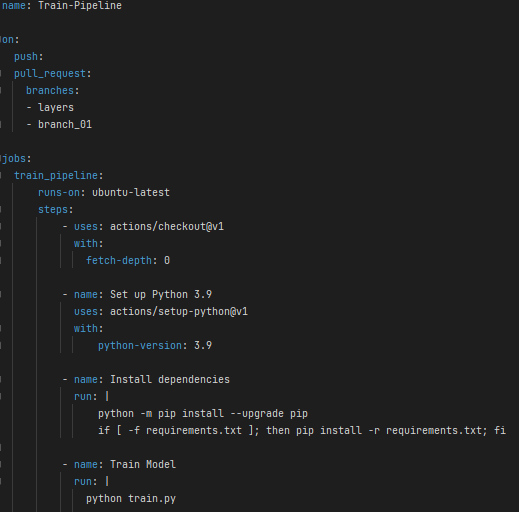

# Unidade 3 - 5. Pipelines

- Origem: [Canvas](https://pucminas.instructure.com/courses/230797/pages/unidade-3-5-pipelines)

---

#### **Pipelines**

Uma *pipeline* é uma sequência automatizada de processos no desenvolvimento de software, composta por várias etapas. Ela automatiza e facilita o desenvolvimento e a entrega, é altamente personalizável e pode ser adaptada às necessidades específicas de uma equipe ou projeto. As *pipelines* ajudam a garantir a qualidade, detectar e corrigir problemas e melhorar a colaboração.

Assista à seguir um vídeo explicando o que são as pipelines:

#### **GitHub Actions**

O GitHub Actions é uma ferramenta que permite criar *pipelines* automatizadas para executar tarefas específicas em resposta a eventos no seu repositório do GitHub. Essas tarefas podem incluir testes de código, compilação de software, implantação em servidores, entre outras. O GitHub Actions é altamente personalizável e pode ser configurado para atender às necessidades específicas de uma equipe ou projeto. Ele é integrado ao GitHub e possui um "Marketplace" de elementos prontos para serem utilizados.

Uma pipeline no GitHub Actions é composta por um ou mais jobs, que podem ser executados em paralelo ou em sequência, dependendo da configuração. Cada job é uma sequência de tarefas que são executadas em um ambiente específico, como uma máquina virtual ou um contêiner Docker. Os jobs podem ser configurados para depender uns dos outros, permitindo que a pipeline seja executada de forma ordenada e controlada. O arquivo workflow contém instruções para o GitHub Actions executar as etapas desejadas em resposta a eventos como push de código ou abertura de *pull request.*

As *pipelines* no GitHub Actions podem ser visualizadas por meio da sequência de jobs que serão ou que já foram executados conforme a figura abaixo.

 Algumas vantagens de se utilizar uma pipeline no GitHub Actions são:

- **Simplicidade**: o GitHub Actions é fácil de usar e configurar, permitindo que equipes de desenvolvimento possam criar *pipelines* automatizadas sem a necessidade de conhecimentos avançados em programação ou infraestrutura.

- **Integração com o GitHub**: o GitHub Actions é integrado ao GitHub, permitindo que as *pipelines* sejam executadas em resposta a eventos específicos no seu repositório do GitHub, como push de código ou abertura de *pull request*.

- **Funciona para CI & CD**: o GitHub Actions pode ser utilizado tanto para integração contínua (CI) quanto para entrega contínua (CD), permitindo que as equipes de desenvolvimento automatizem todo o processo de desenvolvimento e entrega de software.

- **Flexibilidade**: o GitHub Actions é altamente personalizável e pode ser configurado para atender às necessidades específicas de uma equipe ou projeto.

- **Marketplace de elementos prontos**: o GitHub Actions possui um "Marketplace" de elementos prontos para serem utilizados, como ações, ambientes e integrações, que podem ajudar a acelerar o processo de criação de *pipelines*.

- **Documentação**: o GitHub Actions possui uma documentação completa e atualizada, que pode ajudar as equipes de desenvolvimento a entenderem como utilizar a ferramenta de forma eficiente.

**Criação de uma Pipeline no GitHub Actions**

 A criação de uma pipeline no GitHub Actions manualmente envolve os seguintes passos:

1. Crie um arquivo chamado workflow.yml no diretório .github/workflows do seu repositório.

2. Defina o nome da pipeline e os eventos que devem acioná-la. Por exemplo:

name: Minha Pipeline  
on:  
  push:  
    branches: [ main ]  
  pull\_request:  
    branches: [ main ]

Nesse exemplo, a pipeline será acionada sempre que houver um push na *branch main* ou uma *pull request* aberta para a *branch main*.

3. Defina os jobs que serão executados na *pipeline*. Por exemplo:

jobs:  
  build:  
    runs-on: ubuntu-latest  
    steps:  
    - name: Checkout  
      uses: actions/checkout@v2  
    - name: Build  
      run: make build

Nesse exemplo, o *job build* será executado em uma máquina virtual Ubuntu e consiste em duas etapas: *checkout* (para baixar o código do repositório) e *build* (para compilar o código).

4. Faça o *commit* do arquivo workflow.yml no seu repositório do GitHub.

Após seguir esses passos, a *pipeline* será executada automaticamente sempre que os eventos definidos forem acionados.

Um exemplo de uma pipeline feita para executar o treino de um modelo a cada push de alterações no repositório pode ser vista a seguir:

