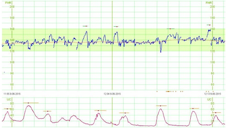

# Unidade 3 - 6. Apresentação do Problema

- Origem: [Canvas](https://pucminas.instructure.com/courses/230797/pages/unidade-3-6-apresentacao-do-problema)

---

#### **Apresentação do Problema**

Nesta seção será apresentado o problema que abordaremos durante as práticas da disciplina. O problema que abordaremos será o do "Sofrimento Fetal e o Exame da Cardiotocografia". O sofrimento fetal ocorre quando o feto não recebe oxigênio suficiente durante o trabalho de parto, o que pode levar a complicações graves ou até mesmo à morte fetal. A cardiotocografia é um exame que pode ajudar a detectar sinais de sofrimento fetal, monitorando a frequência cardíaca fetal, os movimentos fetais e as contrações uterinas. Se os resultados do exame indicarem um risco de sofrimento fetal, medidas adicionais podem ser tomadas para proteger a saúde do feto e da mãe.

Acompanhe a descrição do problema no vídeo a seguir:

A figura a seguir mostra um exemplo do exame que abordaremos:

  

Utilizaremos um conjunto de dados que apresenta as principais características extraídas dos exames. Nosso papel será em aplicar as melhoras práticas e fundamentos na criação de pipelines para o problema em questão. O modelo preditivo utilizado classifica as leituras dos exames em três classes

- **Normal**: trabalho de parto está ocorrendo normalmente;
- **Suspeito**: o bebê apresenta alguns sinais de risco e deve-se ter uma atenção especial;
- **Doente**: bebê já se encontra em sofrimento fetal e o parto deve ser encaminhado para uma cesariana.
