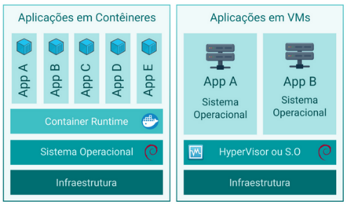
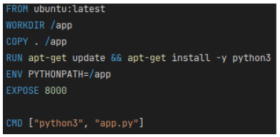

# Unidade 4 - 1. Deploy de modelos - Docker

- Origem: [Canvas](https://pucminas.instructure.com/courses/230797/pages/unidade-4-1-deploy-de-modelos-docker)

---

#### **Containers**

Containers são unidades isoladas de software que empacotam todas as dependências e bibliotecas necessárias para executar um aplicativo. Eles fornecem uma maneira consistente e portátil de implantar aplicativos em diferentes ambientes. Os containers permitem isolamento de aplicativos, portabilidade, eficiência de recursos, escalabilidade e facilidade de implantação.

Em outras palavras, os containers são uma forma de empacotar um aplicativo e todas as suas dependências em um único pacote, que pode ser executado em qualquer ambiente que suporte containers. Isso torna mais fácil e eficiente implantar e executar aplicativos em diferentes ambientes, sem se preocupar com as diferenças entre eles. Além disso, os containers permitem que os aplicativos sejam isolados uns dos outros, o que aumenta a segurança e a estabilidade do sistema como um todo.

Existem várias ferramentas de containers disponíveis, cada uma com suas próprias vantagens e casos de uso específicos. Além do Docker, algumas das ferramentas mais conhecidas e amplamente utilizadas como: **Podman**, **K8s**, **containerd**, **rkt** e **OpenShift.**

À seguir, os principais conceitos sobre containers, imagens e Docker são apresentado:

Agora, em relação à vantagem de usar o Docker, ele é amplamente adotado e amplamente reconhecido por várias razões:

- **Padronização**: O Docker estabeleceu um padrão de fato para contêineres, o que significa que os contêineres Docker são altamente portáteis e podem ser executados em qualquer lugar que suporte Docker, independentemente do sistema operacional ou da infraestrutura subjacente.
- **Ampla Comunidade e Ecossistema**: O Docker possui uma comunidade enorme e um ecossistema rico em ferramentas, imagens e recursos. Isso torna mais fácil encontrar suporte, documentação e soluções para uma variedade de casos de uso.
- **Simplicidade de Uso**: O Docker fornece uma interface de linha de comando intuitiva e uma configuração relativamente simples, o que o torna acessível para iniciantes, bem como para usuários avançados.
- **Eficiência de Recursos**: O Docker é conhecido por sua eficiência em termos de recursos, o que significa que os contêineres têm um impacto mínimo no desempenho do sistema, tornando-os ideais para ambientes de desenvolvimento e produção.
- **Segurança**: O Docker implementa várias camadas de segurança, isolando os contêineres uns dos outros e do sistema hospedeiro. Isso ajuda a evitar vazamentos de dados e outros problemas de segurança.
- **Gerenciamento de Recursos**: O Docker oferece recursos de gerenciamento avançados, como Docker Compose para orquestração de aplicativos de vários contêineres e Docker Swarm para clusters de contêineres.

Em resumo, o Docker é uma escolha popular devido à sua ampla adoção, facilidade de uso, portabilidade e ecossistema robusto. No entanto, a escolha da ferramenta de contêiner depende dos requisitos específicos do seu projeto e das preferências da sua equipe. Outras ferramentas mencionadas também têm suas próprias vantagens e podem ser mais adequadas para cenários específicos.

**Containers Docker - Fundamentos**

Os fundamentos do Docker incluem:

- **Imagem Docker**: é uma representação estática de um aplicativo e seu ambiente de execução. Ela contém todas as dependências e configurações necessárias para executar o aplicativo.
- **Dockerfile**: é um arquivo que contém as instruções para criar uma imagem Docker. Ele descreve como o aplicativo deve ser configurado e quais dependências devem ser instaladas.
- **Container**: é uma instância em execução de uma imagem Docker. Ele contém o aplicativo e todas as suas dependências, isolados do restante do sistema.
- **Kernel do sistema *host***: ao contrário das VMs tradicionais, que emulam todo um sistema operacional, os containers compartilham o kernel do sistema *host*. Isso torna os containers mais leves, eficientes e rápidos de iniciar.

Esses são os principais fundamentos do Docker, que permitem criar, executar e gerenciar aplicativos em containers de forma eficiente e portátil. A principal diferença entre containers e máquinas virtuais é que os containers compartilham o kernel do sistema *host*, enquanto as máquinas virtuais emulam todo um sistema operacional. Isso torna os containers mais leves, eficientes e rápidos de iniciar do que as máquinas virtuais. Além disso, os containers permitem que os aplicativos sejam isolados uns dos outros, enquanto as máquinas virtuais isolam todo o sistema operacional. Isso torna os containers mais flexíveis e escaláveis do que as máquinas virtuais, especialmente em ambientes de nuvem e de microserviços. No entanto, as máquinas virtuais ainda são úteis em alguns casos, como quando é necessário isolar completamente um sistema operacional ou executar diferentes sistemas operacionais em um mesmo *host*.

**Criando uma Imagem Docker Customizada**

Para criar uma imagem Docker customizada, você pode seguir os seguintes passos:

1. Crie um arquivo Dockerfile que descreva como a imagem deve ser construída. O Dockerfile contém as instruções para instalar as dependências, copiar os arquivos do aplicativo e configurar o ambiente de execução. Você pode usar comandos como FROM, RUN, COPY, CMD e outros para definir a imagem.
2. Coloque o Dockerfile em um diretório vazio junto com os arquivos do aplicativo que você deseja incluir na imagem.
3. Abra um terminal e navegue até o diretório onde o Dockerfile está localizado.
4. Execute o comando "docker build -t nome-da-imagem ." para criar a imagem. O parâmetro "-t" define o nome da imagem e o ponto final "." indica que o Dockerfile está no diretório atual.
5. Aguarde até que a imagem seja construída. Isso pode levar alguns minutos, dependendo do tamanho da imagem e da velocidade da conexão com a internet.
6. Verifique se a imagem foi criada com sucesso executando o comando "docker images". A imagem customizada deve aparecer na lista de imagens disponíveis.

Com esses passos, você pode criar uma imagem Docker customizada para o seu aplicativo. Lembre-se de que você pode personalizar o Dockerfile de acordo com as necessidades do seu aplicativo e ambiente de execução. Abaixo segue um exemplo de arquivo Dockerfile usado para criar uma imagem customizada:

