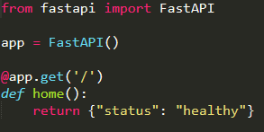
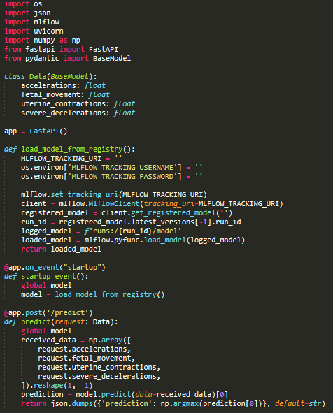
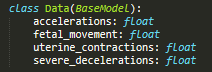
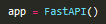
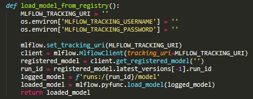
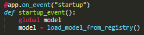
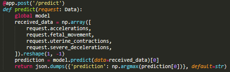

# Unidade 4 - 2. Deploy de modelos - APIs

- Origem: [Canvas](https://pucminas.instructure.com/courses/230797/pages/unidade-4-2-deploy-de-modelos-apis)

---

**APIs - *Application Programming Interface***

Uma API (*Application Programming Interface*) é um conjunto de regras e protocolos que define como diferentes softwares podem interagir entre si. Ela fornece uma interface padronizada para acessar recursos e funcionalidades de um software, permitindo que outros aplicativos possam se integrar e interagir com ele de forma programática.

As APIs são amplamente utilizadas na indústria de software para permitir a comunicação entre diferentes sistemas e serviços. Elas são usadas para obter informações, enviar/receber dados e acessar recursos, como bancos de dados, serviços de nuvem, redes sociais, entre outros.

A principal vantagem de usar APIs é que elas permitem que diferentes aplicativos se comuniquem de forma padronizada e automatizada, sem a necessidade de intervenção manual. Isso torna a integração entre sistemas mais fácil, rápida e confiável, reduzindo o tempo e o custo de desenvolvimento de software. Além disso, as APIs promovem a reutilização de código e aceleram o desenvolvimento de software, permitindo que os desenvolvedores se concentrem em criar novas funcionalidades em vez de reinventar a roda.

Assista, à seguir, um vídeo sobre APIs:

**Protocolos de comunicação utilizados nas APIs**

Os protocolos usados nas APIs são contratos entre um provedor e um usuário de informações, estabelecendo o conteúdo exigido pelo consumidor (a chamada) e o conteúdo exigido pelo produtor (a resposta). Eles definem as regras e formatos de comunicação entre os sistemas, incluindo a forma como os dados são transmitidos, autenticados, autorizados e validados.

Os protocolos mais comuns usados nas APIs incluem HTTP, REST, SOAP, JSON, XML, entre outros. Cada protocolo tem suas próprias características e finalidades, dependendo do tipo de aplicação e dos requisitos de segurança, desempenho e escalabilidade. Por exemplo, o protocolo HTTP é amplamente utilizado para comunicação web, enquanto o REST é um estilo arquitetural que define como os recursos devem ser expostos e manipulados. O JSON e o XML são formatos de dados usados para representar informações em um formato legível por máquina.

Em resumo, os protocolos são essenciais para garantir a interoperabilidade e a segurança das APIs, permitindo que diferentes sistemas possam se comunicar de forma padronizada e confiável.

**Padrão Arquitetural REST**

É um estilo arquitetural de aplicações que define um conjunto de princípios para projetar sistemas distribuídos baseados em recursos da web. Ele foi criado para padronizar a forma como as APIs são projetadas e implementadas, tornando-as mais simples, escaláveis e interoperáveis.

O padrão REST apresenta alguns princípios de estilo, como a separação clara entre cliente e servidor, a não armazenagem de estado no servidor (stateless), o uso consistente de métodos HTTP e manipulação de recursos por meio de identificadores (URLs), a transferência de estado representacional (as respostas do servidor contêm representações do estado atual do recurso solicitado) e a possibilidade de usar uma arquitetura em camadas para escalabilidade e desempenho.

Uma API RESTful é aquela que adere estritamente aos princípios e restrições do estilo arquitetural REST, permitindo que diferentes sistemas possam se comunicar de forma padronizada e interoperável.

**Métodos HTTP**

Os principais métodos HTTP usados em APIs são:

1. **GET**: Método genérico para qualquer requisição que busca dados do servidor;
2. **POST**: Método genérico para qualquer requisição que envia dados ao servidor;
3. **PUT**: Método específico para atualização de dados no servidor;
4. **DELETE**: Método específico para remoção de dados no servidor.

Esses métodos são usados para manipular recursos em um servidor web, permitindo que os clientes possam enviar e receber dados de forma padronizada e segura. O método GET é usado para recuperar informações de um recurso, enquanto o POST é usado para enviar informações para um recurso. O método PUT é usado para atualizar um recurso existente, enquanto o DELETE é usado para remover um recurso existente.

Além desses métodos, existem outros métodos HTTP menos comuns, como HEAD, OPTIONS, TRACE e CONNECT, que são usados para fins específicos, como obter informações sobre um recurso, verificar a disponibilidade de um servidor ou estabelecer uma conexão segura.

**FastAPI**

FastAPI é um framework web de alto desempenho para construção de APIs com Python 3.6+ baseado em padrões abertos e padrões da web, como o padrão REST e o protocolo HTTP. Ele foi lançado em 2018 e tem como principais características a rapidez no desenvolvimento, a facilidade de uso, a robustez e a alta performance.

FastAPI é construído sobre o framework ASGI (*Asynchronous Server Gateway Interface*), que permite que as APIs sejam executadas de forma assíncrona e escalável, aproveitando ao máximo o poder do Python assíncrono. Ele também usa o Pydantic para validação de dados e geração automática de documentação interativa, tornando o processo de desenvolvimento mais rápido e menos propenso a erros.

FastAPI é uma opção popular para desenvolvedores que buscam uma solução rápida e eficiente para construção de APIs em Python, especialmente para aplicações de alta performance e escalabilidade.

A figura à seguir mostra um exemplo de código usando o FastAPI no qual a aplicação é utilizada e uma rota básica é criada.

**Criando uma API para fazer as predições com FastAPI**

Para se criar uma API para fazer inferências com o FastAPI, serão feitos os seguintes passos:

- Criar uma classe de dados
- Criar a aplicação
- Ler o modelo do registro
- Criar a função para ler o modelo no início da aplicação
- Criar o método de predição

O código a seguir apresenta todos os passos anteriores em um script para ser usado como uma API

Cada etapa pontuada anteriormente pode ser vista diretamente no script.

- Criação da classe de dados

- Criar a aplicação

- Leitura do modelo do registro

- Criação a função para ler o modelo no início da aplicação

- Criação o método de predição

