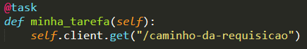

# Unidade 4 - 3. Teste de carga

- Origem: [Canvas](https://pucminas.instructure.com/courses/230797/pages/unidade-4-3-teste-de-carga)

---

#### **Testes de Carga**

Os testes de carga (ou *load tests*, em inglês) em modelos de ML referem-se à avaliação do desempenho e capacidade de um modelo em lidar com grandes volumes de dados ou requisições simultâneas. Em vez de avaliar a precisão ou acurácia do modelo, os testes de carga visam entender como o modelo se comporta sob carga intensa.

Aqui estão alguns aspectos importantes sobre testes de carga em modelos de *machine learning*:

1. **Simulação de Cargas Elevadas**: Esses testes envolvem simular situações onde o modelo é submetido a um grande número de requisições ou um volume alto de dados de uma só vez. Por exemplo, em uma aplicação de recomendação de produtos, isso poderia ser simulado por um grande número de usuários acessando a plataforma simultaneamente.
2. **Monitoramento de Desempenho**: Durante o teste de carga, métricas como tempo de resposta, latência e taxa de erro podem ser monitoradas. Essas métricas ajudam a avaliar se o modelo está conseguindo lidar com a carga de maneira eficiente.
3. **Identificação de Estrangulamentos**: Testes de carga podem revelar possíveis pontos de estrangulamento no sistema. Por exemplo, pode ficar evidente que o modelo está sendo sobrecarregado ou que o servidor de aplicação está tendo dificuldades para lidar com as requisições.
4. **Escalonamento e Otimização**: Com base nos resultados dos testes de carga, é possível realizar ajustes no ambiente de execução do modelo, como escalonamento horizontal ou vertical, otimização de código, entre outros, para melhorar a capacidade de resposta sob carga.
5. **Garantia de Confiabilidade**: Ao submeter o modelo a testes de carga, é possível garantir que ele seja capaz de lidar com situações de pico sem falhar ou degradar significativamente o desempenho.
6. **Planejamento de Capacidade**: Os resultados dos testes de carga podem ser usados para determinar os recursos necessários para suportar uma determinada carga esperada no ambiente de produção.
7. **Simulação de Cenários Extremos**: Em alguns casos, é importante entender como o modelo se comporta em cenários extremos. Por exemplo, um modelo de processamento de linguagem natural pode ser submetido a uma grande quantidade de dados de entrada muito longos.

Lembrando que os testes de carga em modelos de *machine learning* são especialmente relevantes em aplicações que envolvem inferência em tempo real, onde a capacidade de resposta do modelo é crucial para uma boa experiência do usuário.

**Teste de carga com Locust**

O Locust é outra poderosa ferramenta para realizar testes de carga e estresse em aplicações web, incluindo serviços de machine learning que disponibilizam uma API HTTP. O Locust é bastante popular devido à sua simplicidade de uso e escalabilidade.

Para criar um teste de carga com o Locust, primeiro, é essencial garantir que a biblioteca esteja instalada. Se ainda não o fez, você pode instalá-la utilizando o comando `pip install locust`.

Em seguida, crie um arquivo Python, por exemplo `meu_teste_de_carga.py`, onde você irá escrever o script do teste. Dentro deste arquivo, importe a classe `HttpUser` do Locust, que servirá como a base para o seu teste. É a partir dessa classe que você irá definir o comportamento dos usuários virtuais.

Agora, adicione tarefas ao seu teste. As tarefas são funções Python decoradas com `@task` que representam os diferentes tipos de requisições que você deseja simular. Cada tarefa deve conter a lógica para realizar uma requisição, utilizando `self.client.get` ou `self.client.post` para interagir com a aplicação. Por exemplo:

Além disso, você pode definir o comportamento dos usuários virtuais através da configuração de um tempo de espera (`wait_time`). Isso indica quanto tempo cada usuário virtual aguarda entre as requisições. Por exemplo, `wait_time = between(1, 5)` significa que o tempo de espera varia aleatoriamente entre 1 e 5 segundos.

Para iniciar o teste, abra um terminal, navegue até o diretório onde está o arquivo Python do seu teste de carga e execute o comando `locust -f meu_teste_de_carga.py`.

Isso abrirá uma interface gráfica do Locust no navegador, onde você poderá configurar o teste. Você pode definir o número total de usuários virtuais, a taxa de usuários gerados por segundo, o endereço da aplicação a ser testada, e o tempo máximo de execução do teste.

Ao clicar em "Start Swarming", o Locust começará a simular a carga, enviando requisições à aplicação conforme definido no script.

Enquanto o teste está em execução, na interface do Locust você poderá monitorar métricas como o número de requisições por segundo e o tempo de resposta médio.

Em resumo, ao seguir esses passos, você criará e executará um teste de carga utilizando o Locust, proporcionando a capacidade de avaliar o desempenho da sua aplicação sob diferentes cargas simuladas.
