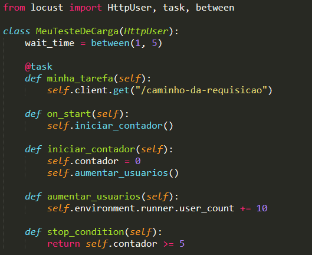

# Unidade 4 - Desafio e Resolução

- Origem: [Canvas](https://pucminas.instructure.com/courses/230797/pages/unidade-4-desafio-e-resolucao)

---

#### **Desafio 4 - Teste de Elasticidade no Locust**

**Enunciado**

Crie um teste de elasticidade de exemplo para uma aplicação que posteriormente se tornaria uma API para predição.  

**Resolução**

Um teste de elasticidade no contexto do Locust envolve simular um aumento ou diminuição dinâmica da carga para avaliar como o sistema responde a mudanças na demanda. Para isso, você pode usar estratégias de escalabilidade automática ou ajustar manualmente o número de usuários virtuais durante a execução do teste.

**Ajuste Manual do Número de Usuários Virtuais:** No Locust, você pode ajustar manualmente o número de usuários virtuais durante a execução do teste. Para fazer isso, utilize a função `environment.runner.user_count` para aumentar ou diminuir a carga no script de teste. Por exemplo, se você quiser aumentar o número de usuários virtuais em 10 a cada 30 segundos, você pode fazer algo assim:

Esta é uma abordagem básica. Você pode adaptar e expandir conforme necessário para atender às necessidades específicas do seu teste de elasticidade. Lembre-se de que realizar testes de elasticidade em um ambiente de produção ou em serviços reais requer cuidado e planejamento adequados para evitar impactos negativos. Recomendo sempre conduzir testes de elasticidade em ambientes controlados ou durante períodos de baixa carga para minimizar possíveis interrupções no serviço.
