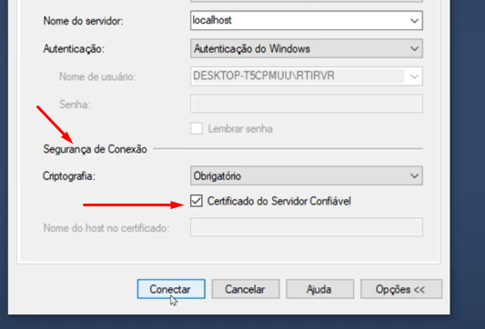

# Unidade 2 - Instalação SQLServer

- Origem: [Canvas](https://pucminas.instructure.com/courses/230799/pages/unidade-2-instalacao-sqlserver)

---

**Atenção: No minuto 08:20 do vídeo, em que se logar no SQL Server, via Management Studio, a tela de login irá exigir que marque um item conforme a figura abaixo. No momento de criação do vídeo não havia essa exigência. O Restante se manterá igual à gravação.**

****
