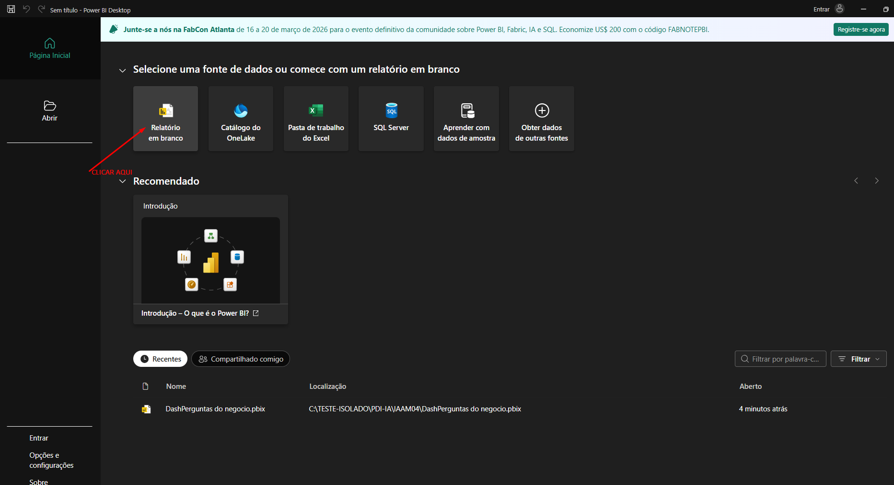
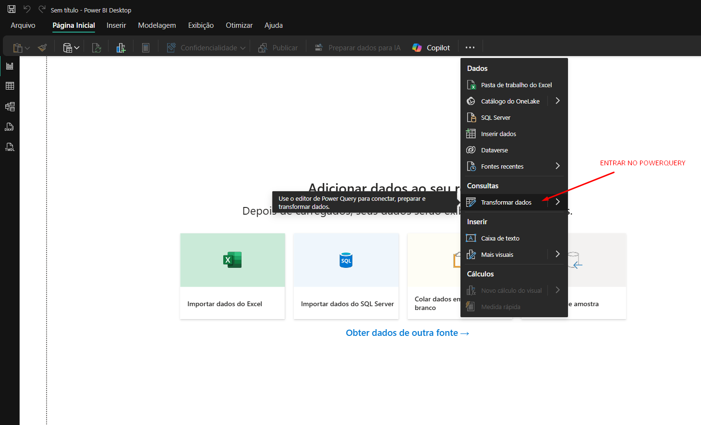

# Unidade 2 - Overview Power BI

- Origem: [Canvas](https://pucminas.instructure.com/courses/230799/pages/unidade-2-overview-power-bi)

---

**!!!ATENÇÃO**: O Power BI sofreu uma pequena atualização após a gravação da aula. Portanto, **considerem os dois itens indicados nas imagens para acessar o Power Query**, os irão ser um pouco diferentes do**acesso ao Power Query do vídeo**. O restante no vídeo permanece igual **no que tange ao foco da nossa disciplina**.

1) Ao abrir o Power Bi clique em Relatório em Branco

2) Abrir o Power Query

